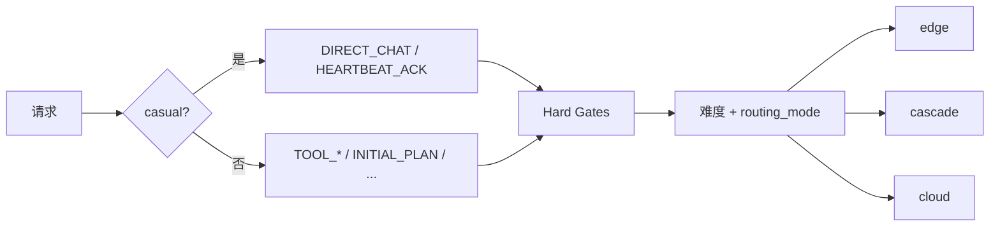

# Flowy Router

端云 LLM 智能路由：**单一 `flowy` 可执行文件** — CLI 管理命令与 Gateway 守护进程合并在同一二进制中。Agent（OpenClaw、Hermes 等）将 OpenAI 兼容 `base_url` 指向 Gateway 即可，在 Agent 行为不变的前提下降低云端 **输入 Token** 成本。

---

## 产品概述

### 背景

自主 Agent（如 [OpenClaw](https://github.com/openclaw/openclaw)、[Hermes Agent](https://github.com/NousResearch/hermes-agent)）在一次用户意图下往往触发 **多轮 LLM 推理**：ReAct 循环中每一步都是独立的 Chat Completions 请求，且每步都会重发 **完整 system + 全历史 + 工具 schema**。

实测（OpenClaw 类负载）单次请求约 **52,830 输入 Token / 357 输出 Token**，输入占比 **99%+**。因此 Flowy 的首要优化目标是 **少把巨型 prompt 送进云端计价模型**，而非压缩输出。

端侧小模型 / MoE（如 Qwen3.5-35B-A3B）适合 Agent 循环中的轻推理步骤；云端旗舰模型保留给规划、复杂工具链、长文档理解等。

### 定位

| 维度 | 说明 |
|------|------|
| **是什么** | Agent 专用的 OpenAI 兼容模型代理：端云统一接入 + 按 **Inference Step** 粒度的路由 + 成本/质量可观测 |
| **主要服务对象** | OpenClaw、Hermes 及同类「自带 Gateway + Agentic Loop + 可配置 OpenAI-compatible endpoint」的运行时 |
| **不是什么** | 不是 Agent 本体（不负责工具执行、记忆、消息渠道） |
| **核心价值** | 在可控质量下减少云端输入 Token 次数与体量 |

### Agent 集成示意

```
┌─────────────────┐     ┌──────────────────┐     ┌─────────────────────┐
│ OpenClaw /      │     │  Flowy Router    │     │ Edge（Ollama 等）    │
│ Hermes Gateway  │────►│  逐请求路由       │────►│ 或                  │
│ Agentic Loop    │     │  base_url 替换    │     │ Cloud（DeepSeek 等） │
└─────────────────┘     └──────────────────┘     └─────────────────────┘
```

| 职责 | Agent | Flowy Router |
|------|-------|--------------|
| 工具执行、记忆、Skills | ✅ | ❌ |
| 单次 LLM 调用的端/云选择 | ❌ | ✅ |
| 端侧低质量时的 Cascade / Fallback | ❌ | ✅ |
| 日常/心跳标为 casual、路由 edge/cascade | ❌ | ✅ |
| 路由与 Token 统计（`flowy_meta`） | 可选 | ✅ |

---

## 架构

```
┌─────────────────────────────────────────────────────────────┐
│  flowy（单一二进制）                                          │
│    flowy gateway start  →  后台 re-exec 自身为 HTTP 守护进程   │
│    flowy env / stats / setup / gateway status  →  CLI 管理   │
└───────────────────────────────┬─────────────────────────────┘
                                │
                    OpenClaw / Hermes ────────┘
                    POST /v1/chat/completions
                                │
        ┌───────────────────────┼───────────────────────┐
        ▼                       ▼                       ▼
  Hard Gates            Difficulty + Policy      Experience + Adaptive
  (命中则定路)           (Profile / Cascade)       (运行时微调)
        │                       │                       │
        └───────────────────────┴───────────────────────┘
                                ▼
                    Edge Runtime / Cloud Adapter
```

**路由决策流水线**（每次 `POST /v1/chat/completions`）：

1. **硬约束层** — 命中则直接定路由，不算分（端侧不可用、上下文溢出、连续 tool 错误、高危工具、assistant 失败恢复等）
2. **信号提取** — 从 `messages[]` / `tools[]` 提取 token 估算、步态 `step_kind`、会话 `cloud_sticky_until`
3. **难度评分** — 可解释加权公式 \(d \in [0,1]\)，叠加经验偏置 `EXP_BIAS`
4. **策略映射** — Profile 的 `θ_edge` / `θ_cloud` + `routing_mode`（`DirectChat` / `HeartbeatAck` 为 casual 步态，**不强制端侧**，可走 edge / cascade / cloud）
5. **Work 步态** — `InitialPlan` / 规划意图 → 云；执行步态默认端侧或抽样 `WORK_VERIFY_SAMPLE`（Cascade+云校验）
6. **Cloud sticky 覆盖** — 粘性有效期内 Work 执行步态 → `STICKY_CASCADE_RETRY`（先端后侧）；日常/心跳不受影响
7. **多模态 / 端侧繁忙** — 简单多模态日常可走端；复杂多模态走云；端侧忙时 **Work/级联** 步态可临时升云，**casual 不受影响**
8. **自适应层**（可选）— 根据 `experience.json` + `stats.json` 运行时微调校验率与阈值（不写回配置）

> **重要**：路由 **不读取** 请求体外的 Flowy 自定义头；步态与难度仅由 `messages[]` / `tools[]` 与 `config.toml` 推断。调试请看响应 JSON 的 **`flowy_meta`**（`route`、`step_kind`、`reason_codes` 等）；流式响应另带 `X-Flowy-*` 头（与 `flowy_meta` 字段对应）。

---

## 1. 安装

需要 [Rust](https://rustup.rs/)（`cargo` 可用）。

```bash
git clone <your-repo-url> flowy-router
cd flowy-router
cargo build --release
# 或
make release
```

| 二进制 | 路径 |
|--------|------|
| flowy | `target/release/flowy` |

**加入 PATH**

```bash
export PATH="$PWD/target/release:$PATH"
# 或
make install
cp target/release/flowy ~/.local/bin/
```

**Windows（PowerShell）**：`$env:Path += ";$PWD\target\release"`

### Electron / 动态库

可将 Gateway **嵌入 Electron 主进程**（无需单独启动 CLI 守护进程）：

```bash
make release-dylib
# Windows: target/release/flowy_router.dll
# macOS:   target/release/libflowy_router.dylib
# Linux:   target/release/libflowy_router.so
```

C 头文件：`ffi/flowy_router.h`。Node/Electron 可通过 [koffi](https://github.com/Koromix/koffi) 等加载 DLL 并调用：

| 函数 | 说明 |
|------|------|
| `flowy_router_start(config_path, err, err_len)` | 后台启动 Gateway；`config_path` 可为 `NULL`（默认 `~/.flowy-router/config.toml`） |
| `flowy_router_stop(err, err_len)` | 停止并等待线程退出 |
| `flowy_router_is_running()` | 是否运行中 |
| `flowy_router_gateway_url(buf, len)` | 写入 `http://host:port` |
| `flowy_router_version()` | 库版本 |

最小示例见 `example/electron/`（`npm install && node main.mjs [config.toml]`）。

---

开发调试可用 `cargo run -- gateway start` 或 `make start`：

```bash
make start
# 等价于 flowy gateway start
```

---

## 2. 配置文件

所有业务配置写在 **TOML** 中，不使用 `FLOWY_*` 环境变量（日志级别除外：`RUST_LOG=flowy_router=debug`）。

| 系统 | 配置路径 |
|------|----------|
| Linux / macOS | `~/.flowy-router/config.toml` |
| Windows | `%USERPROFILE%\.flowy-router\config.toml` |

```
~/.flowy-router/
  config.toml       # 主配置
  gateway.pid       # 守护进程 PID
  stats.json        # 路由/流量累计统计（持久化）
  experience.json   # 按 step_kind 的隐式路由经验
  sessions/         # 每会话状态（含 cloud_sticky）
  logs/gateway.log  # Gateway 日志
```

**示例配置**

| 文件 | 用途 |
|------|------|
| [example/config.toml](./example/config.toml) | 推荐：Ollama + DeepSeek，`route = auto` |
| [example/config.economy.toml](./example/config.economy.toml) | 提高端侧占比：`economy` + 自适应 |
| [example/config.edge-only.toml](./example/config.edge-only.toml) | 固定端侧 |
| [example/config.minimal.toml](./example/config.minimal.toml) | 最小模板 |

```bash
mkdir -p ~/.flowy-router
flowy setup                    # 交互式填写云端/端侧配置
# 或复制示例后编辑
cp example/config.toml ~/.flowy-router/config.toml

# 或指定路径
flowy --config example/config.toml setup
flowy --config example/config.toml gateway start
make setup CONFIG=example/config.toml
make start CONFIG=example/config.toml
```

首次 `flowy gateway start` 时若 `config.toml` 不存在，会自动写入默认模板。

---

## 3. 使用流程

### 3.1 启动 Gateway

```bash
flowy gateway start
# 或 make start
```

首次启动示例输出：

```text
Created config at /home/you/.flowy-router/config.toml — edit upstream sections, then restart if needed.
gateway started (pid 12345, listen 127.0.0.1:11080, profile balanced)
```

### 3.2 初始化上游（setup）

```bash
flowy setup                                          # 交互式向导（默认）
flowy setup --cloud-url https://api.deepseek.com/v1 --cloud-key sk-...  # 非交互
flowy setup --edge-url http://127.0.0.1:11434/v1 --edge-model qwen3
flowy setup --remote                                 # 交互式，热更新运行中的 Gateway
flowy setup --non-interactive                        # 仅写入默认模板（cloud model=auto，edge 空）
flowy setup --reset                                    # 恢复默认（cloud model=auto，edge 清空）
flowy setup --json                                     # JSON 输出（跳过交互）
```

**Web 配置页**：浏览器打开 `http://127.0.0.1:11080/setup`（地址与 `gateway.listen` 一致）。页面可查看/保存 **上游**（edge/cloud URL、模型、API Key）与 **Gateway**（`route`、`ctx_edge_max_tokens`、`cloud_sticky_ttl_secs`、经验/自适应/校验率等）；若配置了 `admin_token`，保存与「恢复默认」需在页面填写 Admin Token（等同请求头 `X-Flowy-Admin-Token`）。

默认值：**云端** `model = auto`（转发时保留客户端请求的 model，由 Flowy 路由）；**端侧** 未配置（`edge` 段为空）。

### 3.3 编辑配置并重启

至少配置一侧上游的 `base_url`（可用 `flowy setup` 或 Web 页，或手改 `config.toml`）。本地改文件后：

```bash
flowy gateway restart
flowy env
```

**上游可用性**：`[upstream.edge]` 与 `[upstream.cloud]` 至少配置一侧，否则聊天接口返回 **503**。

### 3.4 查看状态

```bash
flowy gateway status
make gateway-status
```

**停止 / 重启**：`flowy gateway stop [--force]`、`flowy gateway restart`

日志写入 `~/.flowy-router/logs/gateway.log`；调试时可 `tail -f` 该文件。

### 3.5 curl 验证

```bash
curl -s http://127.0.0.1:11080/health

curl -s http://127.0.0.1:11080/v1/chat/completions \
  -H "Content-Type: application/json" \
  -d '{
    "model": "flowy-auto",
    "messages": [{"role": "user", "content": "[OpenClaw heartbeat poll]"}]
  }' | jq '{route:.flowy_meta.route,step_kind:.flowy_meta.step_kind,reason_codes:.flowy_meta.reason_codes}'
```

流式：`"stream": true` 时，响应头含 `X-Flowy-Route`、`X-Flowy-Step-Kind` 等（与非流式 `flowy_meta` 同源）。

若配置了 `gateway.api_key`，须加 `-H "Authorization: Bearer <key>"`。

### 3.6 接入 OpenClaw

编辑 `~/.openclaw/openclaw.json`：

```json
{
  "models": {
    "providers": {
      "flowy": {
        "baseUrl": "http://127.0.0.1:11080/v1",
        "apiKey": "",
        "models": [{ "id": "flowy-auto", "name": "Flowy Auto Route" }]
      }
    }
  }
}
```

- `baseUrl` 须与 `gateway.listen` 一致
- `apiKey` 选填：仅当配置了 `gateway.api_key` 时须一致

### 3.7 接入 Hermes

```bash
# hermes setup model → Custom OpenAI-compatible endpoint
# base_url: http://127.0.0.1:11080/v1
```

---

## 4. CLI 命令

| 命令 | 说明 |
|------|------|
| `flowy setup [--remote] [--non-interactive] [--reset] [--json]` | 交互式配置上游（或 CLI 参数非交互） |
| `flowy gateway start [--wait N]` | 后台启动 |
| `flowy gateway stop [--force]` | 停止 |
| `flowy gateway status [--json]` | 运行状态 |
| `flowy gateway restart [--wait N]` | 重启 |
| `flowy env [--json]` | 路径与解析后的配置 |
| `flowy stats [--json] [--lang en\|zh]` | **当前进程**会话统计 |
| `flowy stats --global [--json] [--lang en\|zh]` | **全部历史**（`stats.json`，gateway 未运行也可读盘） |

全局参数：`--config <path>`

**Makefile 快捷目标**：`make help`、`make test`、`make setup`、`make stats`、`make stats-zh`、`make stats-global-zh`

```bash
flowy stats --lang zh          # 中文格式化输出
flowy stats --global --lang zh # 全局累计 + 中文
```

`flowy stats` 输出包含：请求量、路由分布、上游 Token（输入/输出/缓存）、Cloud Input Saved、延迟（TTFT/TPS）、经验学习、**自适应路由（运行时）** 等分区。

---

## 5. HTTP 端点

| 方法 | 路径 | 说明 |
|------|------|------|
| `GET` | `/setup` | 上游配置 Web 页（浏览器） |
| `GET` | `/v1/admin/setup` | 配置 JSON：`gateway`（路由/经验/自适应）、`edge`、`cloud` |
| `POST` | `/v1/admin/setup` | 热更新 `gateway` / `edge` / `cloud`（写回 `config.toml`）；可选 `X-Flowy-Admin-Token` |
| `POST` | `/v1/admin/setup/init` | 恢复默认（cloud model=auto，edge 空）；可选 Admin Token |
| `GET` | `/health` | 存活与上游是否已配置 |
| `GET` | `/v1/admin/status` | 守护进程详情 |
| `GET` | `/v1/admin/stats` | 统计；`?scope=global` 为全部历史 |
| `POST` | `/v1/admin/shutdown` | 优雅关闭；可选 `X-Flowy-Admin-Token` |
| `POST` | `/v1/admin/restart` | 优雅关闭并由独立 `__restart-wait` 进程拉起新实例（同 `flowy gateway restart`）；可选 Admin Token |
| `POST` | `/v1/chat/completions` | OpenAI 兼容聊天（Agent 主入口） |

**响应扩展**（非流式 JSON 根上的 `flowy_meta`，Agent 可忽略）：

| 字段 | 含义 |
|------|------|
| `route` | 实际服务路径：`edge` / `cloud` / `cascade` |
| `step_kind` | 推断步态，如 `direct_chat`、`tool_select`、`heartbeat_ack` |
| `reason_codes` | 路由原因列表（门控、难度、Work、粘性、多模态等） |
| `fallback` | 是否发生过级联升云 |
| `difficulty_score` | 难度分 \(d \in [0,1]\) |
| `profile` | 生效 profile |
| `tokens_in` / `tokens_out` | 本响应 token 统计 |
| `cloud_input_saved` | 若走端侧，估算少送进云的输入 token |

```json
{
  "flowy_meta": {
    "route": "cascade",
    "fallback": false,
    "difficulty_score": 0.35,
    "step_kind": "direct_chat",
    "reason_codes": ["STEP_DIRECT_CHAT", "DIFFICULTY_0.35", "TOK_IN_120"],
    "tokens_in": 120,
    "tokens_out": 48,
    "cloud_input_saved": 60,
    "profile": "balanced"
  }
}
```

---

## 6. 配置字段说明

完整示例见 [example/config.toml](./example/config.toml)。

### 6.1 `[gateway]`

| 字段 | 默认值 | 说明 |
|------|--------|------|
| `listen` | `127.0.0.1:11080` | 监听地址；Agent `baseUrl` = `http://{listen}/v1` |
| `route` | `auto` | `auto` / `edge` / `cloud` / `cascade` |
| `routing_mode` | `cascade` | 仅 `route=auto`：`single` / `cascade` / `split` |
| `default_profile` | `balanced` | `economy` / `balanced` / `premium` / `privacy` |
| `ctx_edge_max_tokens` | `65536` | 端侧上下文上限；超过约 80% 触发 `GATE_CTX_OVERFLOW`；**可热更新** |
| `cloud_sticky_ttl_secs` | `600` | 见 §7.3；**可热更新** |
| `route` / `routing_mode` / `default_profile` | 见上 | **可热更新** |
| `experience_*` / `work_verify_sample_rate` / `adaptive_*` | 见示例 | **可热更新**（`POST /v1/admin/setup` 的 `gateway` 对象） |
| `session_persist_enabled` | `true` | 会话写入 `sessions/`；**改后需重启 Gateway** |
| `api_key` | — | 选填；入站鉴权 |
| `admin_token` | — | 选填；保护 shutdown、restart 与 setup 写操作 |
| `experience_enabled` | `true` | 按 `step_kind` 隐式学习 |
| `experience_learning_rate` | `0.08` | 经验偏置学习强度 |
| `experience_max_bias` | `0.12` | 单步态难度偏置上限 |
| `experience_target_fallback` | `0.15` | 级联升云目标比例（自适应路由参考） |
| `session_persist_enabled` | `true` | 会话写入 `sessions/`（含 `cloud_sticky_until_unix`） |
| `work_verify_sample_rate` | `0.1` | Work 步态云端校验抽样率（0–1） |
| `adaptive_routing_enabled` | `true` | 运行时自适应微调（见 §7.4） |
| `adaptive_min_verified_samples` | `20` | 预热期：云验证样本不足时用配置基线 |
| `adaptive_verify_rate_floor` | `0.05` | 校验率下限 |
| `adaptive_verify_rate_ceiling` | `0.45` | 校验率上限 |
| `adaptive_max_theta_shift` | `0.05` | 健康时 θ 最大放宽幅度 |

#### `gateway.route`

| 值 | 行为 |
|----|------|
| `auto` | 按难度 + profile + routing_mode 选择 |
| `edge` | 全部端侧（仅 `[upstream.edge]`，失败即报错，不升云） |
| `cloud` | 全部云端（仅 `[upstream.cloud]`，失败即报错，不降端） |
| `cascade` | 每请求先 edge，质量不过关再升 cloud |

#### `gateway.routing_mode`（仅 `route = auto`）

结合 `balanced` profile（约 θ_edge=0.35、θ_cloud=0.55）：

| 值 | 难度低 | 难度中 | 难度高 |
|----|--------|--------|--------|
| `single` | edge | cloud | cloud |
| `cascade` | edge | **先 edge，可能升 cloud** | cloud |
| `split` | cloud | cloud | cloud |

#### `default_profile`

| Profile | θ_edge | θ_cloud | 说明 |
|---------|--------|---------|------|
| `economy` | 0.40 | 0.60 | 更多走端 |
| `balanced` | 0.35 | 0.55 | 默认 |
| `premium` | 0.25 | 0.45 | 更多走云 |
| `privacy` | — | — | 尽量 edge |

### 6.2 `[upstream.edge]` / `[upstream.cloud]`

| 字段 | 说明 |
|------|------|
| `base_url` | OpenAI 兼容 API 根路径，**须含 `/v1`**；空表示未配置 |
| `api_key` | 选填；转发时附带 `Authorization: Bearer` |
| `model` | 选填；上游模型 id。云端默认 `auto` = 不覆盖客户端 model；端侧通常填具体模型名 |

至少配置一侧。只配 edge 时全部走端侧；只配 cloud 时全部走云端。

### 6.3 `[cli]`

| 字段 | 说明 |
|------|------|
| `gateway_url` | CLI 访问 Gateway 的 URL，默认 `http://{gateway.listen}` |

### 6.4 常用组合

```toml
# 智能路由 + 级联（OpenClaw 推荐）
route = "auto"
routing_mode = "cascade"
default_profile = "balanced"

# 全部本地
route = "edge"

# 全部云端
route = "cloud"

# 提高端侧比例：economy + 开启自适应（默认已开）
default_profile = "economy"
adaptive_routing_enabled = true

# 日常尽量固定端侧（仍标 direct_chat，但 route 恒为 edge）
# routing_mode = "single"
# default_profile = "economy"
```

### 6.5 日常 / 心跳 vs Agent 任务（速查）

| 目标 | 建议 |
|------|------|
| 日常、心跳走 **casual 步态** + 允许 **cascade** | 默认即可：`route = auto`，`routing_mode = cascade` |
| 日常尽量少升云、常走端 | `default_profile = "economy"`；或 `routing_mode = "single"` |
| 确认路由是否符合预期 | 看 `flowy_meta.step_kind` 与 `reason_codes`（[§5](#5-http-端点)、[§7.7](#77-常见-reason_codes调试)） |
| OpenClaw 大包仍被判成 `tool_select` | 检查 `tok_rest`、多轮是否缺 easy 关键词、是否在 tool 循环 |

---

## 7. 路由与学习

### 7.1 步态（step_kind）

Router 从 `messages[]` 尾部推断当前 **Inference Step** 类型（与 OpenClaw/Hermes 多轮 transcript 形态对齐），例如：

| step_kind | 典型路由倾向 | 说明 |
|-----------|--------------|------|
| `HEARTBEAT_ACK` | casual，按 `routing_mode` 路由（常为 edge 或 cascade） | `[OpenClaw heartbeat poll]` 等 |
| `DIRECT_CHAT` | casual，按 `routing_mode` 路由 | 日常短对话（见下「casual chat」） |
| `TOOL_RESULT_DIGEST` | 端侧 / Cascade | 上一条为 `role: tool` 的摘要步 |
| `TOOL_SELECT` / `TOOL_ARG_FILL` | 端侧或 `WORK_VERIFY_SAMPLE` | Agent 选工具 / 填参 |
| `INITIAL_PLAN` | **云端** | 首轮非 casual 的 Agent 任务，或用户含规划意图 |
| `RECOVERY_AFTER_FAILURE` | **云端** | `assistant turn failed` 等恢复步 |
| `SUBAGENT_SPAWN` | **云端** | spawn 类提示 |
| `FINAL_REPLY` | 端侧 / Work 策略 | 工具链收尾 |

**Casual chat（`DIRECT_CHAT` / `HEARTBEAT_ACK`）** — 只标 **步态**，**不强制端侧**；最终 `route` 由 `routing_mode` + 难度分决定（默认 `routing_mode = cascade` 时，日常常见 **`edge` 或 `cascade`**，亦可 `cloud`）。

| 条件 | 说明 |
|------|------|
| 体量 | 用 **`tok_rest`**（transcript，**不含** system、**不含** tools schema）< 8192；**不用**整包 `tok_total_in` |
| 轮次 | 用户消息数 ≤ 8 |
| 排除 | 有 tool 往返、`pending_tool_calls`、`intent_hard`、失败恢复、图+tools 并存等 |
| 多轮 + tools | 最新 user 须命中 **easy 意图**关键词（如你好、天气、笑话、谢谢、再讲…） |
| 多轮无 tools | 最新 user 很短（`last_user_tok` ≤ 512）也可视为 casual 跟帖 |

OpenClaw 带巨型 system/tools 的「你好」仍可标为 `direct_chat`；`GATE_CTX_OVERFLOW` 对 casual **只按 `tok_rest` 计**。`DirectChat` / `HeartbeatAck` **不受** `GATE_EDGE_BUSY` 挤到纯云。

OpenClaw 特征：心跳、`assistant turn failed`、Inbound Meta、`exec` 等 Tier-1 工具触发硬约束。



### 7.2 硬约束（Hard Gates）

命中任一则 **跳过难度评分**，直接定路由（多为云端）：

| 规则 | 条件 |
|------|------|
| `GATE_EDGE_DOWN` | 未配置 `[upstream.edge]` 或不可用 |
| `GATE_CTX_OVERFLOW` | 输入 token > 80% × `ctx_edge_max_tokens`；**`DIRECT_CHAT` / `HEARTBEAT_ACK` 仅按 `tok_rest`（transcript）计**，避免 OpenClaw 巨型 system/tools 误伤日常 |
| `GATE_TOOL_ERROR_STREAK` | transcript 尾部 **连续 2 条** `role=tool` 且内容含错误关键词 → 当次升云并 `force_cloud_sticky` |
| `GATE_ASSISTANT_FAILURE` | 最近 assistant 含失败标记（`RecoveryAfterFailure`） |
| `GATE_RISKY_TOOL` | Tier-1 工具（exec/write/browser/spawn 等） |
| `GATE_OPENCLAW_COMPACT` | `MEMORY_COMPACT` 且上下文 > 12k token |
| `GATE_EDGE_BUSY` | 端侧已有推理进行中（且云端可用）→ **非 casual** 的 edge/cascade 步态当次直走云 |
| 复杂多模态 | 非 `DirectChat` 的多模态 → `MULTIMODAL_COMPLEX_CLOUD` |

> **已移除** `GATE_STICKY_CLOUD`：粘性不再作为硬门控把 **所有** 步态钉在云上。

### 7.3 Cloud sticky（会话级）

粘性用于「本会话近期不稳定，执行步态再给端侧一次机会」，**不是**按步数计数，而是 **Unix 时间戳 TTL**（`cloud_sticky_ttl_secs`，默认 600s），保存在 `sessions/<conv>.json` 的 `cloud_sticky_until_unix`。

**何时开启粘性**（续期 TTL）：

- 级联回退到云（`cascade_fallback`）
- 上游错误（非心跳步态）
- `GATE_TOOL_ERROR_STREAK`（`force_cloud_sticky`）

**何时清除粘性**：

- 任一路径 **端侧成功**：`edge_ok && !cascade_fallback && !upstream_error`（含 Cascade 端侧过关未升云）

**粘性有效期内的路由**（非硬门控，在 Work 路由之后覆盖）：

| 步态 | 行为 |
|------|------|
| `DIRECT_CHAT` / `HEARTBEAT_ACK` | 照常走策略映射（edge / cascade / cloud），**不**被粘性改成纯云 |
| Work 执行（`TOOL_SELECT`、`TOOL_RESULT_DIGEST`、`FINAL_REPLY` 等） | `STICKY_CASCADE_RETRY` → **Cascade**（先 edge，质量门不过再 cloud） |
| `INITIAL_PLAN` / 规划意图（`PLAN_INTENT_CLOUD`） | **仍走云** |
| `RECOVERY_AFTER_FAILURE` | **仍走云**（assistant 失败门控或策略） |

调试时在 `flowy_meta.reason_codes` 中查找 `STICKY_CASCADE_RETRY`。

### 7.4 三层动态优化

| 层级 | 数据源 | 作用 | 持久化 |
|------|--------|------|--------|
| **静态配置** | `config.toml` | profile、校验率基线 | 是 |
| **经验学习** | 每次请求 outcome | 按 `step_kind` 调整难度偏置；足够样本后标记 `edge_trusted` | `experience.json` |
| **自适应路由** | experience + stats | 运行时微调 `work_verify_sample_rate`、`θ_edge`/`θ_cloud` | **否**（仅内存） |

**自适应路由**（`adaptive_routing_enabled = true`）逻辑摘要：

- **预热**：云验证样本 < `adaptive_min_verified_samples` 时保持配置基线
- **健康**（回退率 ≤ 目标、信任步态足够）：降低校验抽样率、略放宽 `θ_edge` → 提高端侧使用率
- ** struggling**（回退率偏高）：提高校验率、收紧阈值 → 保证复杂任务正确率
- **级联统计**：`stats.json` 中级联回退率 > 28% 时进一步收紧
- 每约 **30 秒** 或 **40 个请求** 刷新；`flowy stats --lang zh` 可查看生效值与 `ADAPTIVE_*` 原因码

**安全边界**：InitialPlan、复杂多模态、Hard Gates、高难度走云/级联 — **不会被自适应放宽**。

### 7.5 Work 步态与规划

| reason_code | 含义 |
|-------------|------|
| `INITIAL_PLAN_CLOUD` | 步态为 `INITIAL_PLAN` |
| `PLAN_INTENT_CLOUD` | 用户含规划/计划类意图，且处于 ToolSelect 等步态 |
| `WORK_EXEC_EDGE` | Work 执行步态默认尝试端侧 |
| `WORK_VERIFY_SAMPLE` | 抽样命中：Cascade + 云端校验（`WorkStrategy::Verify`） |
| `WORK_CACHE_EDGE` | `experience` 已标记该 `step_kind` 为 `edge_trusted` |

`work_verify_sample_rate`（0–1）控制 `WORK_VERIFY_SAMPLE` 抽样；自适应层可在 `[floor, ceiling]` 内动态调整。

### 7.6 级联（Cascade）

**非流式** `route = cascade` 或 `STICKY_CASCADE_RETRY` / `WORK_VERIFY_SAMPLE` 等路径：

1. 端侧完整生成
2. **Quality Gate**（`cascade_gate_pass`）通过条件（满足其一即可）：
   - 非空 `content`，长度 > 8，且不含「不确定」
   - 合法 `tool_calls`：至少一条，且每条 `function.name` / `arguments` 非空（覆盖 `TOOL_RESULT_DIGEST` 后模型只返回 tool call、无长文本的情况）
3. 不通过 → 升云并重答（`cascade_fallback = true`，可能续期 sticky）
4. 通过 → 该步以端侧结果返回（`edge_ok = true`），可清除 sticky

**流式** Cascade：仅在端侧 **HTTP 失败** 时升云，不做中途 token 质量切云。

端侧命中一步 ≈ 节省该步全部云端输入 Token（OpenClaw 场景约 **~52k token/步**）。

### 7.7 常见 reason_codes（调试）

| reason_code | 含义 |
|-------------|------|
| `STEP_*` | 当前 `step_kind`（如 `STEP_DIRECT_CHAT`） |
| `DIFFICULTY_*` / `TOK_IN_*` | 难度分与输入 token 估算 |
| `EXP_BIAS_*` | 经验偏置 |
| `GATE_*` | 硬门控命中（casual 一般不出现 `GATE_CTX_OVERFLOW` 全包误判） |
| `STICKY_CASCADE_RETRY` | 粘性期内 Work 执行走级联 |
| `MULTIMODAL_SIMPLE_EDGE` | 简单多模态日常走端 |
| `MULTIMODAL_PROBE` / `MULTIMODAL_COMPLEX_CLOUD` | 多模态探测或复杂走云 |
| `ADAPTIVE_*` | 自适应层生效说明 |

### 7.8 成本模型（设计约束）

单步云端成本近似 \(c_{in}^{cloud} \cdot T_{in}\)（输出占比 <1% 可忽略）。10 步 loop 全云端约 **528k 输入 token**；7 步改端侧可降至 **~158k（↓70%）**。

---

## 8. 常见问题

**`flowy` not found** — `cargo build --release` 或将 `target/release` 加入 PATH。

**`gateway did not become healthy within 30s`** — 检查端口占用；查看 `~/.flowy-router/logs/gateway.log`；确认 `listen` 与 `cli.gateway_url` 一致。

**Agent 无真实回复** — 确认上游 `base_url` 可达；未配置任何上游时返回 503。

**OpenClaw 日常「看起来」仍走云**（排障，非默认行为）— 正常标为 casual 时 `step_kind` 应为 `direct_chat` 或 `heartbeat_ack`，决策上多为 **edge / cascade**（见 §7.1）。用 `flowy_meta` 区分三种情况：

1. **`step_kind` 不是 casual** → 未进日常步态，常直接云或走 Work。查：`tool_select` / `initial_plan`（tool 循环中且最新 user 无 easy 关键词）、`tok_rest` ≥ 8192、`n_turns` > 8、含规划意图、assistant 失败恢复。
2. **`step_kind` 对，但 `route` = `cloud`** → 查 `reason_codes` 里 `GATE_*`、`CONFIG_ROUTE_*`，或 `route = "cloud"` / `premium` + 高难度分。
3. **`route` = `cascade` 且 `fallback` = true** → 路由先端侧，**质量门未过**升云重答（§7.6）；不是 sticky 把日常钉在云上。

Casual **不强制端侧**；要尽量少云可 `default_profile = "economy"` 或 `routing_mode = "single"`（§6.5）。Work 步态出现 `GATE_CTX_OVERFLOW` 时可调大 `ctx_edge_max_tokens`（casual 溢出门控只计 `tok_rest`）。

**日常想用端侧但总是 cascade** — 默认 `routing_mode = cascade` + balanced 难度阈值所致；要更多纯 edge 可改 `routing_mode = "single"` 或 `default_profile = "economy"`。

**粘性期内全是云** — 已移除 `GATE_STICKY_CLOUD`；**日常/心跳** 不受粘性改路；**Work 执行** 在粘性期走 `STICKY_CASCADE_RETRY`（先端后云）。端侧成功会清除 sticky。

**停止无效** — `flowy gateway stop --force`

**stats 里「已持久化 false」** — 表示当前查看的是 **会话（session）** 范围，非「未写入磁盘」；`--global` 查看跨重启累计。

---

## 9. 开发与测试

```bash
make test          # 或 cargo test
cargo test routing # 只测路由
make check
```

```
example/      # 配置示例（见 example/README.md）
src/
  config/     # 路径 + config.toml
  gateway/    # 守护进程（路由、API、上游、stats、experience）
  stats_cmd.rs
  main.rs     # CLI + __serve
tests/        # CLI 集成测试
Makefile      # 常用 dev/ops 目标
```

---

## 10. 路线图

| 阶段 | 内容 | 状态 |
|------|------|------|
| MVP | OpenAI Gateway、Profile、Single/Cascade、OpenClaw 步态、Hard Gates | ✅ |
| 可观测 | `stats.json`、`flowy stats`、Token 分解、TTFT/TPS、Cloud Input Saved | ✅ |
| 经验学习 | `experience.json`、按 step_kind 偏置与 `edge_trusted` | ✅ |
| 自适应路由 | 运行时微调校验率与 θ（experience + stats） | ✅ |
| 端侧利用率 | casual 用 `tok_rest`、不强制 edge、casual 溢出门控、粘性 Cascade、tool_calls 过关、setup 热更新 | ✅ |
| 增强 | 轻量难度分类器、Split 模式、流式 Cascade 早停、Bandit | 规划中 |
| 企业 | SSO、审计、多租户预算熔断 | 规划中 |

---

## 11. 附录

### OpenClaw system 分段标记（实现参考）

```
STATIC_END_MARKER = "# Dynamic Project Context"
INBOUND_MARKER    = "## Inbound Context"
RUNTIME_MARKER    = "## Runtime"
HEARTBEAT_USER    = /^\[OpenClaw heartbeat poll\]/
ASSISTANT_FAILED  = /\[assistant turn failed/
```

### 工具风险分级（摘要）

| 层级 | 示例工具 | 策略 |
|------|----------|------|
| Tier-1 | `exec`、`write`、`browser`、`sessions_spawn` | 强制云 |
| Tier-2 | `read`、`process`、`web_fetch` | Cascade |
| Tier-3 | `memory_get`、`session_status` | 端侧优先 |

### 指定其它配置文件

```bash
flowy --config /path/to/dev.toml gateway start
flowy --config /path/to/dev.toml stats --lang zh
```

CLI 与 Gateway 守护进程须使用 **同一份** `config.toml`。

---

**文档维护**：产品与实现变更请同步更新本 README。
